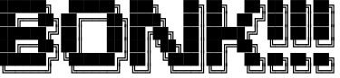
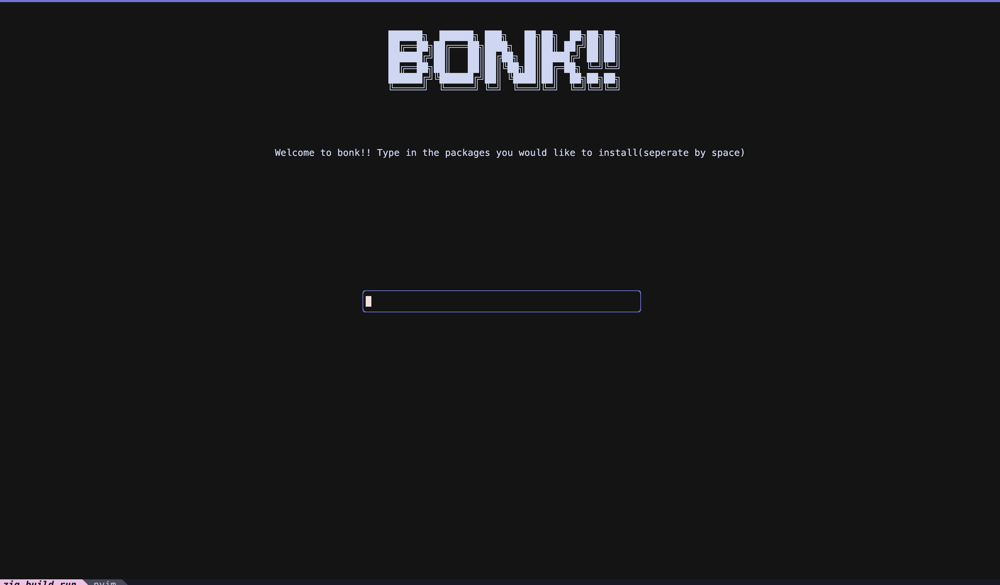

# BONK TUI

BONK!! is a TUI tool that aids management of bun packages, for now it's still in very early development stages. All it does for now is remove the need to write `bun add` or `bun install`.

 

## Screenshots

 
## Roadmap

- display output of command
- Show contents of package.json, if there is no package.json, return an error

## License

[unlicense](https://choosealicense.com/licenses/unlicense/)

## Acknowledgements

 - [Libvaxis](https://github.com/rockorager/libvaxis)
